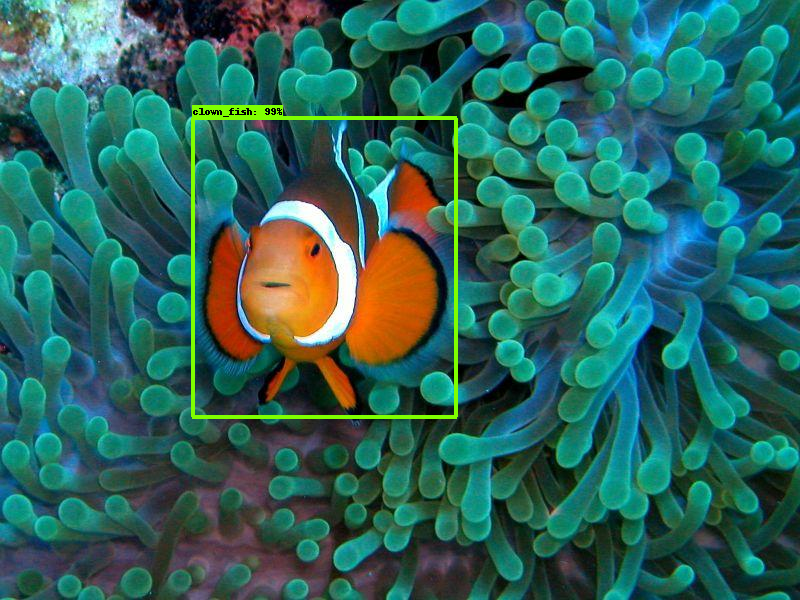

# Finding Nemo with Tensorflow on Google Cloud ML Engine

.png)
.png)

Prerequisits:
 - Installed Tensorflow and Object Detection API
 - Having set up Google Cloud ML Engine 

Steps are as follows:
1. Prepare the dataset
   - Collect images
   - Label the images
   - Generate TFRecords
2. Select a pre-trained model and configure the pipeline
3. Train the model
   - Upload files to the Google Cloud
   - Submit the training and evaluation jobs
4. Use the model

## Prepare the dataset
The training and testing image data is fed in form of TFRecords.
### Collect and prepare images
In this example, the image set was built using images from [Imgenet](http://www.image-net.org/) and Google images. (Didn't feel like diving). If you are using imgenet, you can save the urls from the *Downloads* tab to a .txt file and use the following to download the images.
```
$ get -i url_list.txt
```
Thats it! simple and painless. <br><br>
After selecting appropriate images, divide them for training, testing and validating the model. In this example, 190 images were used as follows: <br>
- Train - 150
- Test - 30
- Validate - 10

Also, there were more than one clownfish in some images, therefore actal number of exmples was larger.

### Label the images
For labeling the object we are interested in, (a clown fish in this case) [LabelImg](https://github.com/tzutalin/labelImg#labelimg) was used. 

After labeling is done, we have xml files for each of the image in the training and testing sets. 
### Generate TFRecords
For creating the TFRecords, pascal_to_tfrecord.py was used. The script is from [Object detection in the context of permaculture](https://github.com/vituslehner/permaculture-object-detection). 

## Select a pre-trained model and configure the pipeline
For this example, faster_rcnn_resnet101_coco_11_06_2017 was used, following the [Quick Start: Distributed Training on the Oxford-IIIT Pets Dataset on Google Cloud](https://github.com/tensorflow/models/blob/master/research/object_detection/g3doc/running_pets.md).
For configuring the pipeline, one of the example config files provided with the API was used (available [here](https://github.com/tensorflow/models/tree/master/research/object_detection/samples/configs)) with changes to the parameters according to the training job. I used the faster_rcnn_resnet101_pets.config. The essential points to change are as follows.
- num_classes: 1
	- We are interested in finding only one object, a clownfish. Therefore, the above variable is 1.
- fine_tune_checkpoint: "gs://my_bucket/data/model.ckpt"
	- This points to the trained model checkpoint file which needs to be uploaded to our storage bucket on the cloud.
- input_path: "gs://your_bucket/data/train.record"(under *train_input_reader:* for the training set)
- label_map_path: "gs://your_bucket/data/labelmap.pbtxt" (under *train_input_reader:* for the training set)
- input_path: "gs://your_bucket/data/test.record"(under *eval_input_reader:* for the testing set)
- label_map_path: "gs://your_bucket/data/labelmap.pbtxt" (under *eval_input_reader:* for the testing set)

Also, it's reocommended to run a few number of steps first to see how everything works and to see how the loss is reducing. To do this change the  num_steps: parameter. I first tried with 500 steps.<br>
In addition to this, there are many other parameters that can be changed to get the best performance such as *learning_rate*. But, the default values are okay to start and get things going.

 
## Train the model
### Upload files to theGoogle Cloud
To do the training on cloud, following structure is suggested for the storage bucket.
```
your_bucket
	+data
    		-train.record
            -test.record
            -labelmap.pbtxt
            -model.ckpt.data
            -model.ckpt.meta
            -model.ckpt.index
            -faster_rcnn_resnet101_pets.config
   +train
   +test
   ```
### Submit training and evaluation jobs
Packaging
```
# From tensorflow/models/research/
bash object_detection/dataset_tools/create_pycocotools_package.sh /tmp/pycocotools
python setup.py sdist
```
and,
```
cd slim && python setup.py sdist
```

Training
```
#From tensorflow/models/research
gcloud ml-engine jobs submit training object_detection_`date +%m_%d_%Y_%H_%M_%S` \
--runtime-version 1.8 \
--job-dir=gs://your_bucket/train/ \
--packages dist/object_detection-0.1.tar.gz,slim/dist/slim-0.1.tar.gz,/tmp/pycocotools/pycocotools-2.0.tar.gz \
--module-name object_detection.train \
--region us-central1 \
--config object_detection/samples/cloud/cloud.yml \
-- \
--train_dir=gs://your_bucket/train/ \
--pipeline_config_path=gs://your_bucket/data/faster_rcnn_resnet101_pets.config
```
Evaluating
```
#From tensorflow/models/research
gcloud ml-engine jobs submit training object_detection_eval_`date +%m_%d_%Y_%H_%M_%S` \
--job-dir=gs://your_bucket/train \
--packages dist/object_detection-0.1.tar.gz,slim/dist/slim-0.1.tar.gz,/tmp/pycocotools/pycocotools-2.0.tar.gz \
--module-name object_detection.eval \
--region us-central1 \
--scale-tier BASIC_GPU \
--runtime-version=1.8 \
-- \
--checkpoint_dir=gs://your_bucket/train \
--eval_dir=gs://your_bucket/test \
--pipeline_config_path=gs://your_bucket/data/faster_rcnn_resnet101_pets.config
```
Note:
I ran in to some errors, which are apprently related to deploying replicas. As a workaround, I removed the workers. Therefore, the cloud.yml file looked like this.
Since this is a simpler training job (one catagory, small no. of imges) this did not affect very much.
